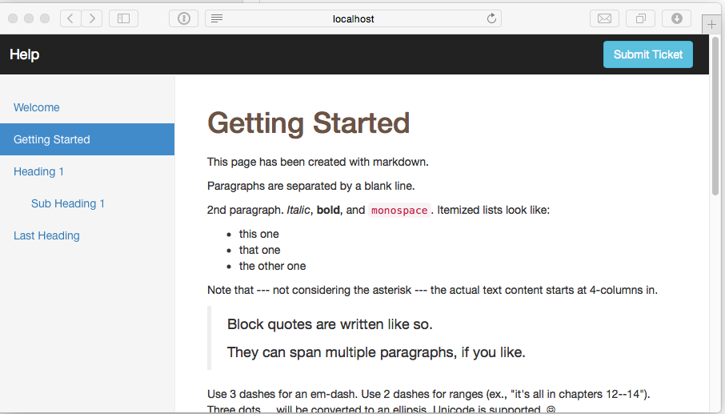

markdown-help
=============

Create user documentation with markdown. A template with a sidebar with links is also provided. Simple convention based user documentation can be quickly created.

Create document like the below easily

##How does it work
Its quite simple actually.

1. Clone this repository locally. 
2. Add a few markdown files that form your documentation.
3. Update the index.html file to create links on your sidebar that will help people navigate your documentation.
4. The links have to be added in this fashion -

 If your markdown file is called welcome.md, then add a link like the below into index.html
 
    <li class="active"><a href="?opentarget=welcome.md">Welcome</a></li>

If you would like to indent the link to group them like Heading 1 and Sub Heading 1, then just add the class 'subSidebar' to the list item

    <li class="subSidebar"><a href="?opentarget=subdirectory/subheading1.md">Sub Heading 1</a></li>

You can organise your markdown files into directories and just specify the location in the link, just like the above.

##Technical Details
There are 3 important files

* index.html - This is the page that has links to the markdown files on the sidebar
* marked.min.js - This has been lifted from the excelled markdown to HTML conversion library called *marked* located here [chjj/marked](https://github.com/chjj/marked).
* articleLoader.js - This reads the markdown file based on the URL and serves it to marked. The HTML result from marked is appended to the main html.

The remaining files are your markdown files that form the basis of your user documentation.

